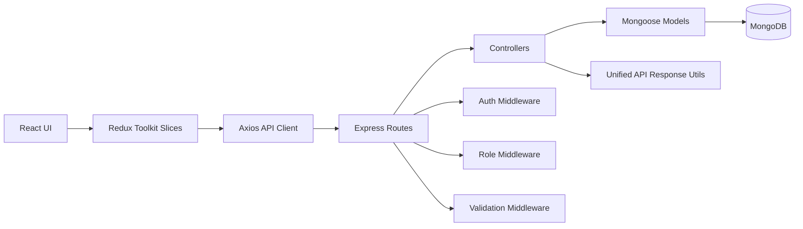

## Kalpathon Hackathon Submission

- Team Name : VibeX

- Project Name : Neighbourhood Service Marketplace

- Selected Track : Track 1 = Web Development

- Selected Problem Statement (PS) : PS-01 / Neighbourhood Service Marketplace - Full-stack marketplace connecting customers with verified local providers in real time

- Team Leader 

        Name: Ayush Singh 
        Phone: +91-6386844047

- Team Members and Roles

        Ayush Singh - Full Stack Developer  ( Backend Developer and Integration )
        Daksh Chauhan - Full Stack Developer ( API Building & Testing )
        Arya Dixit - UI/UX Desginer and Prototyping ( Figma / Canva )

---
### Project Description

Problem: Finding trusted local service providers is still difficult in many neighborhoods. People often rely on unverified contacts, delayed responses, and scattered communication, while providers struggle to reach nearby customers and manage bookings efficiently.

Solution: Neighbourhood Service Marketplace is a full-stack web platform that connects customers with local providers through a single, easy-to-use interface. Users can discover services by category and location, place bookings in real time, and track booking status. Providers get a dedicated dashboard to manage incoming requests, update service listings, and monitor earnings.

Key Features:
1. Smart service discovery with search, category/location filters, sorting, and pagination.
2. Role-based booking system with secure authentication, booking status workflow, and provider-side management.
3. Trust layer with post-completion reviews and dynamic service ratings.

Tech Stack:
- React 19,
- Redux Toolkit
- React Router
- Tailwind CSS
- Node.js
- Express 5
- MongoDB
- Mongoose
- JWT Authentication
- Axios.

Impact: The platform strengthens neighborhood-level service access by helping customers find reliable providers faster and giving local professionals a digital channel to grow their business. This improves convenience, transparency, and local economic participation.

### Additional Links 

- Presentation: [Link](https://drive.google.com/file/d/1EA8SbBExVrPtXRE7NsqsLHTsYJJVdtH0/view?usp=drivesdk)
- GitHub: [Repository](https://github.com/DakshChauhan2005/Vibex_ayushsingh.git)
- Frontend Deployed ( Full-Stack ) : [Link](https://vibex-ayushsingh.vercel.app/)
- Backend Deployed : [Link](https://opencare-yw75.onrender.com)

---
# Home Services Marketplace

Full-stack platform where users can discover local services, book providers, and leave reviews after completed bookings.

## Table of Contents

1. Project Overview
2. Tech Stack
3. Architecture
4. Repository Structure
5. Backend Documentation
6. Frontend Documentation
7. API Reference
8. Data Model
9. Environment Variables
10. Local Setup
11. Deployment Notes
12. Known Gaps and Future Scope

## Project Overview

This repository contains:

- Backend API using Express + MongoDB
- Frontend app using React + Redux Toolkit + Vite
- Role-based flows for `user`, `provider`, and `admin`

Core user journeys:

- Register/login and fetch profile
- Browse and filter services
- Create bookings and track booking status
- Provider dashboard for bookings, earnings, and service management
- Post-review flow gated by completed booking

## Tech Stack

### Backend

- Node.js + Express 5
- MongoDB + Mongoose
- JWT auth
- express-validator
- Security middleware: helmet, cors, express-rate-limit

### Frontend

- React 19
- React Router
- Redux Toolkit + React Redux
- Axios
- Tailwind CSS 4
- Framer Motion (installed)

## Architecture



### Request Lifecycle

1. UI dispatches async thunk (Redux slice).
2. Thunk calls Axios instance (`Authorization: Bearer <token>` when available).
3. Express route applies validation and auth/role middleware.
4. Controller executes business logic using Mongoose models.
5. Response is normalized through `successResponse` / `errorResponse`.

## Repository Structure

```text
Backend/
	config/        # DB connection
	controller/    # Business logic handlers
	middleware/    # Auth, role, error middlewares
	model/         # Mongoose schemas
	routes/        # API route mapping
	services/      # Infrastructure services (mail)
	src/           # Express app composition
	utils/         # Shared helpers
	validator/     # Request validators

Frontend/
	src/components/ # Reusable UI and route guards
	src/pages/      # Page-level modules
	src/services/   # Axios client
	src/store/      # Redux store and slices
```

## Backend Documentation

### Entry and App Bootstrap

- `Backend/server.js`
	- Loads env vars
	- Enforces required env keys: `MONGO_URI`, `JWT_SECRET`
	- Starts HTTP server (default `PORT=3000`)
- `Backend/src/app.js`
	- Registers global middleware
	- Applies rate limits (`/api/auth` and `/api`)
	- Mounts feature routes
	- Adds 404 and global error handlers

### Middleware Layer

- `auth.middleware.js`: Verifies JWT from Bearer token and injects `req.user`.
- `role.middleware.js`: Authorizes by allowed role list.
- `error.middleware.js`: Standardized 404 and runtime error responses.

### Domain Modules

- Auth: register, login, get current user
- Users: profile read/update, provider listing
- Services: CRUD + search/filter/pagination/sorting
- Bookings: create, user/provider list, controlled status transitions
- Reviews: create/list/delete + service rating recompute
- Providers: dashboard totals (bookings and earnings)

### Business Rules

- Registration role can be `user` or `provider`; `admin` is not self-assignable.
- Booking date must be a future date.
- A provider cannot have overlapping active bookings (`pending` or `accepted`) for same date-time slot.
- Booking transitions allowed:
	- `pending -> accepted`
	- `pending -> rejected`
	- `accepted -> completed`
- Reviews allowed only after at least one completed booking for the target service.
- One review per user per service.

## Frontend Documentation

### App Shell and Routing

- Public routes: `/`, `/login`, `/register`, `/services`, `/services/:id`
- Protected routes: `/dashboard`, `/profile`
- Catch-all redirects to `/404`

### State Management (Redux Toolkit)

- `authSlice`
	- register/login/profile flows
	- persists token and user in localStorage (`nc_token`, `nc_user`)
- `servicesSlice`
	- service list filters, pagination, selected service, CRUD actions
- `bookingsSlice`
	- my bookings, provider bookings, provider dashboard metrics
- `reviewsSlice`
	- service reviews create/list/delete

### API Client

- Axios base URL: `VITE_API_BASE_URL` or fallback `http://localhost:8000/api`
- Automatically attaches bearer token from localStorage

### UI Feature Modules

- `Dashboard`
	- Customer booking history with filters
	- Provider management panel (incoming bookings, create/edit/delete service, earnings cards)
- `Services`
	- Search/filter/sort/pagination and list/grid view toggle
- `ServiceDetails`
	- Provider details, booking form, review list and submission

## API Reference

Base path: `/api`

### Auth

- `POST /auth/register`
- `POST /auth/login`
- `GET /auth/me` (auth)

### Users

- `GET /users/profile` (auth)
- `PUT /users/profile` (auth)
- `GET /users/providers`

### Services

- `POST /services` (auth, provider/admin)
- `GET /services`
- `GET /services/:id`
- `PUT /services/:id` (auth, owner/admin)
- `DELETE /services/:id` (auth, owner/admin)

Query params for list:

- `keyword`, `category`, `location`
- `minPrice`, `maxPrice`
- `sortBy` in `price | rating | createdAt`
- `order` in `asc | desc`
- `page`, `limit`

### Bookings

- `POST /bookings` (auth, user)
- `GET /bookings/my-bookings` (auth, user/admin)
- `GET /bookings/provider` (auth, provider/admin)
- `PUT /bookings/:id/status` (auth, provider/admin)

### Reviews

- `POST /reviews` (auth)
- `GET /reviews/service/:id`
- `DELETE /reviews/:id` (auth, owner/admin)

### Provider Dashboard

- `GET /providers/dashboard` (auth, provider/admin)

### Response Shape

Success:

```json
{
	"success": true,
	"message": "...",
	"data": {},
	"meta": {}
}
```

Error:

```json
{
	"success": false,
	"message": "...",
	"errors": {}
}
```

## Data Model

### User

- `name`, `email`, `password`, `role`, `location`, `isVerified`
- Roles: `user`, `provider`, `admin`

### Service

- `title`, `description`, `category`, `price`, `provider`, `location`
- Derived quality fields: `rating`, `numReviews`
- Indexed for text search and filtering

### Booking

- `user`, `provider`, `service`, `date`, `status`
- Status enum: `pending`, `accepted`, `rejected`, `completed`

### Review

- `user`, `service`, `rating`, `comment`
- Unique index: one review per user-service pair
- Triggers aggregate rating recomputation in service model

### Additional Models Present

- `Chat` and `Message` schemas exist in `Backend/model`, but are not currently wired to routes/controllers.

## Environment Variables

### Backend (.env in Backend/)

Required:

- `MONGO_URI`
- `JWT_SECRET`

Recommended/optional:

- `PORT` (default `3000`)
- `NODE_ENV` (`development` or `production`)
- `CORS_ORIGIN` (default `http://localhost:5173`)
- `JWT_EXPIRES_IN` (default `7d`)
- `AUTH_RATE_LIMIT_MAX`
- `API_RATE_LIMIT_MAX`
- `EMAIL_USER`
- `GOOGLE_APP_PASSWORD`

### Frontend (.env in Frontend/)

- `VITE_API_BASE_URL`

Example:

```env
VITE_API_BASE_URL=http://localhost:3000/api
```

Important: frontend default fallback is `http://localhost:8000/api`, while backend default is `http://localhost:3000`. Set `VITE_API_BASE_URL` to avoid mismatch.

## Local Setup

### 1) Clone and install dependencies

```bash
# Backend
cd Backend
npm install

# Frontend
cd ../Frontend
npm install
```

### 2) Configure env files

- Create `Backend/.env` and add backend variables.
- Create `Frontend/.env` and set `VITE_API_BASE_URL`.

### 3) Run in development

```bash
# Terminal 1: Backend
cd Backend
npm run dev

# Terminal 2: Frontend
cd Frontend
npm run dev
```

Frontend runs on `http://localhost:5173`.

## Deployment Notes

- Frontend has SPA rewrite config (`Frontend/vercel.json`) for client-side routes.
- Configure production CORS origin to frontend domain.
- Use strong JWT secret and production MongoDB URI.
- Ensure rate-limit values are set for production traffic profile.

## Known Gaps and Future Scope

- No automated tests configured yet.
- API docs are in README only (no Swagger/OpenAPI file yet).
- Chat models are currently unused in route/controller layer.
- Email service exists but is not integrated into active auth flows.

